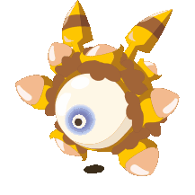
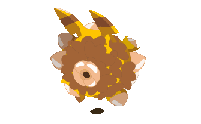
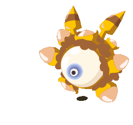
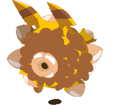

## 1. Ses fichiers dans le jeu  
Le bitolder est présent dans les sprites du jeu, à ma connaissance, le fichier est seulement présent dans la 1.9.1.  
Le fichier se nomme: 1094.swf et est dans le dossier /clips/sprites/ du jeu, le fichier à été crée pour flash player 7 (cf: header du fichier swf).
La beta 17b s'arrête au sprite 1088, la version suivante qui est la 1.0 possède un sprite 1095, le bitolder à du être crée entre la version 17.2b et la 1.0. 
Dans la version 1.9.1, les sprites semblent avoir été recompilé pour flash player 7, la première version du monstre devait être à destination de flash player 6 (cf: sprites 1088 et 1095 des versions 1.0 et 1.9.1).

D'autres références à ce monstre sont égalements présentes dans d'autres endroits:
    - dans les "langs", dans la version française il est nommé bitolder.
    - dans le fichier sprite.xml (présent à partie de la 1.16), il est appelé BITEHOLDER. Il est supprimer de ce fichier dans les dernières version de la version 1 du jeu (dans les 1.20).  

Note: lorsque l'on charge l'apparence du bitolder, il n'y a rien qui apparait, le fichier est peux être corrompu ou non fonctionnel à cause de la version de flash player utilisée.

## 2. Ses informations  

Ses caractéristiques sont disponible ici: https://dofuswiki.fandom.com/wiki/Bitolder ( et il me semble sur un autre site avec son image mais je n'ai plus le lien).
Infos extrait des fichiers:
- id: 151 (comme le premier pokemon) ( l'id 150 est le Noeul, monstre qui lui ressemble un peu)
- gfxid (sprite): 1094
- le monstre a 6 "niveaux", à chaque fois il est lvl 100
- les resistances du wiki fandom semblent correctes:  
  - 25% neutre, 10% terre, 40% feu, 30% air et eau
  - les résistances feu font: 40%,400%,760%,1120%,1480%
- Le nom anglais du monstre semble également le bitolder.

Le monstre n'a pas de petite image qui s'affiche lorsque c'est a son tour de jouer.
Il n'a également aucune ressource associée.
Il est dans la catégorie monstres divers / Boss. (cf: solomonk.fr le bestiaire)

## 3. Son sort  

A ma connaissance, c'est son seul sort.

- nom: Teubatak
- id du sort: 237

Le nom anglais est également Teubatak.

Le sort ne semble pas avoir d'animation.

Voici son sort:
  
Le sort ne semble pas équilibré, il s'agit probablement un placeholder ou d'un sort de test.

## 4. Sa map: La grotte de loopine  
 
Infos de la map:
- mapid: 1567
- coordonnées: 2,17
- capabilities: 15 (en français, la capacité de la map? à noter que la map de la piscine à pichon de sufokia est la seule autre carte à avoir cette valeur)
- La carte semble exister depuis la v17b, je n'ai pas les map de dofus 1.0, cependant sur la map de dofus 1.0 on vois sur qu'il y a une maison sur la mapmonde (comme sur dofus retro).

Voici la map sur laquelle devait être le bitolder: (il s'agit d'une version de mai 2005)

La carte est une grotte, similaire à celle qui abritait le dragon cochon.
 
Les murs sont bien fonctionnels mais il y a une possibilité de se déplacer sur les cases noires derrière les murs de la carte.

Elements "interessants" de la carte:
- Ressemble à la map dragon cochon.
- Beaucoups d'éléments de squelettes.
- Aucune mention nommée Grotte de Loopine.

La carte n'existe plus dans les versions 1.20, elle semble avoir été retirée, tout comme le bitolder.

La première version de cette carte que je possède date de mai 2005 (version 1.7), elle a peux être des version encore plus anciennes.

La carte semble avoir été modifiée et être ressortie avec Dofus rétro 1.38, elle à surtout été débuggée et ce n'est pas la seule ancienne carte à avoir été réintégrée au client. A noter également que sa sous zone a changée pour être intégrée à la sous zone sous terrain mystérieux qui contient les cartes des émotes ainsi que les cartes d'autres sous terrains.

## 5. La carte de l'entrée de la grotte  

J'écris cette partie à la suite d'autres recherche.
En regardant la mapmonde de dofus retro, on vois sur la map 2,17 qu'il y a une maison, au départ je pensais que c'était pour signaler la présence de la grotte, cependant, il y a une chose intéressante à connaitre.
A partir de la 1.0, la carte semble être la version "finale", celle qui est dans dofus rétro actuellement. En revanche, si on regarde [ici](https://web.archive.org/web/20040808030022/http://ophmialeen.free.fr:80/map.htm) et [ici](https://web.archive.org/web/20161017180243im_/http://ophmialeen.free.fr/MapDofusQM/1024.jpg) (une map interactive des premières versions du jeu), on remarque que sur la carte de la version beta 16b, il y a une maison appelée "La maison Arbre", si on prend une carte de la version site web au lieu de la version png, la sauvegarde du site du 5 et 8 aout 2004 (dates de la beta 17, la version 1.0 étant sortie fin aout) indiquent que la maison est désormais à la place de l'atelier alchimiste en 1,16 et qu'il y a désormais une grotte avec un pnj (Loopine) devant.
D'après la version 17b, Loopine à été crée début juillet 2004 (nom du sprite: 9015.swf) ce qui confirme que la carte à été modifiée, la maison arbre à été déplacée et remplacée par la grotte, Loopine à été placé devant cette grotte. 

Sur la carte du monde de la version 1.0 à dofus retro il y a un élément sur cette map, avant la sortie de l'interface de géoposition la carte était dans un livre et sur la map en 2,17 il y avais une maison. Cette maison à été remplacée par une grotte sur les versions avec géoposition. L'icone de la maison n'a pas été déplacé sur la nouvelle map de la maison arbre ensuite située en 1,16 . 

## 6. Ses animations  
Le logiciel que j'ai utilisé ne m'a pas permis de récuperer des sprites correct.

Il est possible que les animations de sort du monstre soient présentes ici et intégrées à sont sprite.
Il semble y avoir 2 "versions": 
- Une sans oreilles
- Une avec des oreilles à la manière de pikachu

  
  
  
  
  
  
  
  
 

Enfin, peux être son sort ou une animation quelconque:  
 

Le fichier est possiblement non complet, le monstre n'a qu'une orientation de disponible, et le fichier possedé n'est pas le fichier original car il est en flash version 7 or dofus 17b/dofus 1.0 utilise des sprite en flash 6.

## 7. Ce qu'on sais et les théories 

Note du 03/11/2022: Cette partie à été entièrement réécrite pour corriger les erreurs et surtout prendre en compte les nouvelles informations. je l'ai également divisée en plusieurs partie.

### Le fichier du sprite 

Il y a beaucoup à dire sur cette partie, au départ je pensais que le monstre avais été crée pour la version 17b mais finalement le monstre à été crée entre la version 17b et la 1.0 mais il a été ajouté plus tard dans les fichiers du jeu, le fichier à été crée le 7 février 2005 soit la veille de la sortie de la version 1.5, je suppose qu'il à été ajouté au client à ce moment la cependant je ne peux pas le confirmer.  
Le fichier est prévu pour flash 7, je pense qu'il à été ajouté aux fichiers du jeu lors de la recompilation des sprites pour les passer de flash player 6 vers flash player 7, bien que dofus 1.0 soit prévu pour flash player 7, les sprites étaient encore en flash player 6.  
Il est également possible que le fichier ai été retiré au passage de dofus vers flash player 8 à l'occasion d'un nettoyage des fichiers du jeu. Le fichier du bitolder n'est plus présent dans la version 1.13 et cette version est toujours compatible flash 7 donc je pense que comme pour le passage de flash 6 à flash 7 il y a eu un moment où les 2 versions étaient compatible ([cette partie est évoquée dans le changelog 1.13.1](https://www.dofus.com/fr/forum/1750-dofus/28490-nouveau-client-1-13-1)). N'ayant pas de client entre dofus 1.10 et 1.12 je ne peux pas confirmer la version exacte (il est possible que ca soit la version 1.13).   

Peu de temps avant la 1.0. Comme le dit kam dans son interview, quelques mois avant la fin de la beta (début 2004, vers les dernières versions beta, 16 et 17 probablement), ils ont ajoutés une grosse quantité de monstres. Les premères beta (5 et 7) ont vraiment peu de monstres, moins de 50, un rush de création de monstre et de zones à eu lieu avant la sortie de la 1.0.

### L'apparition du monstre dans différents fichiers

Le bitolder continue d'être présent dans les fichiers du client jusqu'à dofus 1.20, cela correspond également à des périodes où le développement de dofus 2.0 commencais ou le datamining et le botting commencait, cela expliquerait le nettoyage des sprites non utilisés du client, cela permattait également d'avoir un client qui demande moins d'espace disque.

Coté client, pour le fichier Sprites.xml, le nom BITEHOLDER du monstre serait l'explication du jeu de mot (valable pour beaucoup d'autres jeux de mots de monstre dans le jeu).
BITE HOLDER, en traduisant holder de l'anglais cela donnerait le possesseur de bite? ca me semble cohérent avec l'image du monstre. Il faut également noté que le "vrai" nom des monstres dans ce fichier est le nom "original" du monstre.

Pour la présence du bitolder dans les fichier "lang", il est toujours présent en 2022 sur dofus rétro, les fichiers qui se trouvent coté serveur n'ont jamais été vraiment nettoyé.

### La grotte supposée du bitolder

La carte semble être "vieille", la version de la carte que j'ai date de mai 2005, mais la carte semble avoir été crée pour la beta 17, 
Elle ne semble pas avoir été finalisée, on peux se déplacer derrière les murs. La map extérieur semble être comme ceci depuis avant la 1.0, ce qui montre bien que le monstre et sa grotte ont pu être planifié depuis avant la 1.0 mais que comme d'autres choses, ils ont été retiré par manque de temps pour implanter de manière correcte ce contenu ou car ce contenu était bug.

### La carte de l'entrée de la grotte 

Concernant la carte de l'entrée de la grotte, je pense qu'au départ la maison arbre devais servir mais peux être qu'elle est restée inutile jusqu'en version 1.4 (15 décembre 2004), moment de la création du métier d'alchimiste, je n'ai pas plus d'information sur cette maison.  

Une piste concernant la maison arbre peux être trouvée [ici](https://web.archive.org/web/20040803094025/http://forum.dofus.com:80/Autres/Divers/111619-MaisonArbre).   

L'icone de la grotte sur la carte du monde est utilisée surtout pour des mines et/ou des passages sous terrain à Amakna mais je ne sais pas vraiment ce quelle représente.
L'orientation de la grotte en direction du labyrinthe Dark Vlad pourrais indiquer un passage sous terrain, je suppose qu'il pourrais y avoir un lien avec la mine de Ded Aleïcar. L'icone de la grotte indiquée sur les versions dofus avec la carte du monde semble symboliser soit une mine soit un passage sous terrain.  
Sinon, cette grotte aurais pu être placée pour abriter un boss à la manière de la grotte du Mulou en 4,28. Il me semble que c'était également le cas dans la forêt des abraknydes (A confirmer), elle pourrais également être une grotte similaire à celle de Bellus Sel en 10,11, le pnj garde une grotte (ce qui expliquerait Loopine). La mine de Bellus Sel n'est pas indiquée sur la carte, il est également intéressant que le pnj Bellus Sel, comme pour Loopine n'a jamais été mis à jour (Bellus Sel possède toujours le skin des iop des premières versions de dofus 1). 

### Loopine

Loopine à été crée pour la version 17b, néanmoins le fait qu'il soit simplement nommé Forgeron est étonnant, je n'ai pas assez connu ces versions mais soit il n'y avais pas de forgeron avant cette version (et donc pas de métier de forgeur? je pense ceci peu probable), soit c'était d'abord le skin de Loopine qui est devenu par la suite le skin des Forgerons.
Pour le dialogue du pnj, je pense qu'il n'a jamais été modifié. 

Il se pourrais que Loopine soit le pseudo d'un ancien dev. Le pnj à pu être placé la pour permettre l'entrée dans la grotte et en attendant il avais un dialogue simple pour le coté RP, il sert également à obtenir des parchemins de caractéristiques, dans les débuts du jeu, ces échanges étais considérés comme des quêtes.

### L'implantation du bitolder en jeu

Dans les dernières versions de la beta beaucoup de monstres ont été ajoutés pour rendre le pvm intéressant et peupler le monde du jeu, ces ajout ont du se faire en quelques mois, ce qui explique qu'il y a des endroits inutilisés.

La carte de la grotte ainsi que le monstre pourraient être un placheholder, cette théorie n'est pas impossible mais difficile à croire cependant [un communiqué officiel](https://www.dofus.com/fr/mmorpg/actualites/devblog/billets/1323866-devblog-retro-1-35-approche) évoque l'utilisation de placeholder. Cette théorie peux être cohérente car le bitolder ne semble pas tout à fait terminer mais j'ai des doutes.

A un moment, des problèmes de compatibilités entre les versions de flash [à été évoqué](https://www.dofus.com/fr/forum/1750-dofus/2237-maj-15-nov-2004-aurez-soir), il est possible que les problèmes d'affichage du bitolder viennent de la.

Comme pour le dragon cochon, il est possible que la grotte devais accueillir le bitolder et que le bitolder soit considéré comme un boss.

Je pense également que le bitolder aurait pu être un monstre destiné à être simplement affiché comme ceux à la foire du troll (cf: bouftouGM, bouftous coller et empiler dans une tente de la foire du troll), cela expliquerai qu'il n'ai qu'une orientation et qu'il ne soit pas "complet". 

Le bitolder aurais pu être un monstre pour autre chose de l'univers ankama, il est évoqué [ici](https://www.dofus.com/fr/forum/1750-dofus/2237-maj-15-nov-2004-aurez-soir) la volonté de développer les fonctions RP du jeu. Cela expliquerai qu'il n'ai pas de sprite pour le cadre des tours de jeu par exemple.

### Diverses supposition sur ce qui entoure le bitolder

- La grotte était prête pour la beta 17 avec le bitolder dedans, cependant il y aurais pu avoir des bug qui aurait retarder l'implantation en jeu et finalement aucune vraie sortie.
- La grotte aurait pu être préparée, avec le dialogue de Loopine, le lore du bitolder (A ce que j'ai lu, le "lore" du jeu aurait été "forcé" d'être ajouté pour rendre le jeu cohérent et avoir une vraie histoire), cependant le bitolder aurais pu ne jamais être "prêt" à sortir.

L'id du monstre est le 151, il pourrais être un clin d'oeil potentiel a pokémon, 151 étant le nombre de pokémon en génération 1, comme le monstre ne s'affiche pas, il pourrais être lié aux premiers jeux pokémon avec certains pokémon invisible et donc n'aurais jamais été réellement prévu pour être visible.

L'id du sort du bitolder (237) est intéressant, les id des sorts des 10 premières classes vont de 1 à 200, il ne s'agirait donc que du 37ième sort lié à un monstre, a partir de la, il est possible d'imaginer que le bitolder serait vraiment un des premiers monstres de dofus (et potentiellement crée avant la grotte de loopine).  
Pour information, l'id du sort se place juste avant l'id des sorts des monstres de la forêt maléfique de la 1.29 (qui sont à l'origine les monstres de la zone des bwork ainsi que la zone du cimetière d'amakna), il semble très probable que le bitolder soit lié de plus ou moins loin aux noeul et aux oni.

### Pourquoi on le trouve dans une seule version

Je ne pense pas qu'il ne soit disponible dans la version 1.9.1 mais je n'ai pas les autres clients pour confirmer. Je suppose que le bitolder était disponible pour toutes les versions de dofus qui utilisent flash player 7 en lancant le jeu via le .exe (donc de dofus 1.5 environ jusqu'à environ dofus 1.10).

## 8. La suite

Pour continuer les recherches, je pense qu'il faudrais:
- Rechercher des infos sur la map de la maison de l'arbre avant sont déplacement (avant la v17b)
- Pour continuer les recherches/tests il me faudrais des versions du jeu comprises entre dofus 1.1 et 1.9.0, la version 1.5.0 me semble la plus intéressante car il s'agit de celle qui à du mettre fin à l'utilisation de flash 6 et donc la version dans laquelle le bitolder aurait été ajouté.
- Il me manque également le fichier qui contient l'interface de connexion des beta / des premières versions de dofus 1.x qui pourraient permettre de voir si le bitolder s'afficherai.
- Avoir une version 1.14 "complète" permettrait peux être de mettre la main sur d'ancienne carte (en supposant que toutes les cartes aient été ajoutées à la 1.14 sans être triées)

## 9. Les références au bitolder

Merci à Liche qui fait des vidéos sur le sujet et qui en a parler. [Voir sa vidéo](https://www.youtube.com/watch?v=ag4wu9x4Pgs)

- Au timecode 2:48, le pnj Sbab fait référence aux bitolder.
- Au timecode 3:23, le pnj Philémy Barthémon évoque également le bitolder.
- Un bitolder serait présent dans la base des justiciers, emprisonné.

## CHANGELOG:

04/11/2022: Ajout des informations sur les modifications de la carte de la grotte
03/11/2022: grosse modifications sur les théories suite à la découverte de la v17b
30/05/2021 : Mise à jour "finale" de l'article, sauf si un jour j'arrive à récuperer une version beta 17b, il est actuellement impossible d'aller chercher plus d'élément et de connaitre plus d'éléments.
12/03/2021 : Ajout dans la conclusion d'une partie sur l'id du sort.